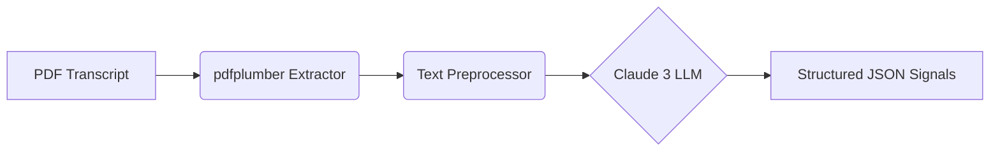

# Earnings Call Supply Chain Mention Extractor

Extract supply chain disruption signals from public company earnings call transcripts using LLMs, with a focus on semiconductor industry suppliers.

## What this project is

A portfolio piece exploring LLM-based extraction from unstructured business documents, built during semester break.

Drawing on a background in Supply Chain Management, this project applies that domain context to a new technical skill area (LLM engineering), producing a focused tool that extracts structured supply chain mentions from public company earnings call documents.

## What this demonstrates

According to the Theory of Constraints, a weakness anywhere in an interconnected supply chain can impact the entire system's value generation. Because early awareness of these shifts is critical, this project harnesses Large Language Models (LLMs) to extract supply chain signals from unstructured company earnings call transcripts. These transcripts often contain early, nuanced indicators of operational health that extend beyond standard structured corporate data. By systematically extracting these signals, this approach generates actionable intelligence, enabling upstream and downstream partners to proactively manage risk and make more informed decisions.

## Example output
For Applied Materials' Q2 FY2026 earnings call, the tool extracted 24 supply chain mentions. One high-signal example:

```json
{
  "category": "supplier_relationship",
  "speaker": "CEO",
  "sentiment": "positive",
  "direct_quote": "long-term collaboration agreement between Applied and SK hynix to accelerate the development and deployment of next-generation DRAM and high-bandwidth memory",
  "signal_strength": "high"
}
```

This single mention captures partner identity (SK Hynix), strategic intent (DRAM/HBM acceleration), and forward-looking commitment (long-term collaboration) — actionable intelligence in 30 seconds vs. reading the full 6-page document.

## How it works



1. **PDF extraction** (`src/pdf_extractor.py`): Convert earnings call PDF to raw text using pdfplumber

2. **Preprocessing** (`src/preprocessor.py`): Reconstruct paragraph structure from pdfplumber's line-per-sentence output

3. **LLM extraction** (`src/mention_extractor.py`): Send cleaned text to Claude with a structured extraction prompt. Output is a JSON array of mention objects, each containing:
   - `category`: one of 6 supply chain categories
   - `speaker`: CEO, CFO, or IR
   - `sentiment`: positive, negative, or neutral
   - `direct_quote`: verbatim text from the source
   - `signal_strength`: high, medium, or low (per [Signal Quality SOP](docs/signal_quality_sop_v1.md))

End-to-end pipeline: `python -m src.pipeline <pdf_path> <output_dir> <name>`

## Signal quality framework

Not all extracted mentions are equally valuable. A mention citing "SK Hynix HBM partnership with specific terms" carries more analytical signal than "our supply chain is performing well."

The project includes a [Signal Quality SOP](docs/signal_quality_sop_v1.md) defining HIGH / MEDIUM / LOW signal tiers, applied during evaluation to:

- Assess prompt iteration effectiveness
- Filter mentions for downstream applications
- Quantify the signal-to-noise ratio of LLM outputs

Cross-quarter evaluation (Q1 vs Q2 FY2026) showed signal distributions vary with business cycle: record quarters (Q2) contain more high-signal mentions due to specific partner agreements and quantitative guidance.

## Tested on

This tool was developed and validated using earnings call prepared remarks from the semiconductor equipment manufacturing sector:

- **Applied Materials (AMAT)** - Q1 FY2026 Earnings Call Transcript (PDF)
- **Applied Materials (AMAT)** - Q2 FY2026 Earnings Call Transcript (PDF)

*Note: While tuned for the semiconductor industry's supply chain terminology, the extraction prompts are designed to be generalizable to other manufacturing and hardware sectors.*

## Known limitations

1. **Source type**: Currently processes "published scripts" (prepared remarks only). Does not include analyst Q&A from full earnings call transcripts. Q&A content typically contains more unfiltered supply chain signals.

2. **LLM determinism**: Uses `temperature=0` for reproducibility. Output is largely consistent across runs but small variance (~5%) remains. Same prompt + same input may produce slight differences in mention count.

3. **Comprehensiveness vs precision**: With `temperature=0`, the LLM tends toward more comprehensive extraction. Some extracted mentions are medium-to-low signal (per the SOP framework). Future versions may add explicit filtering for high-signal-only output.

4. **Single-company validation**: Tested on Applied Materials (semiconductor sector) only. Generalization to other industries or document styles unverified.

5. **No automatic filing retrieval**: PDFs must be manually downloaded from company IR pages. SEC EDGAR was investigated but typically does not contain transcript/script artifacts (only earnings releases as 8-K exhibits).

## Tech Stack

- **Language:** Python 3.13+
- **LLM:** Anthropic (via API)
- **PDF Processing:** `pdfplumber`

## Prerequisites

- Python 3.13 or higher installed
- An active Anthropic API key

## Setup

1. **Clone the repository and set up the environment:**
   ```bash
   git clone https://github.com/dlee408/earnings-supply-signals.git
   cd earnings-supply-signals
   python -m venv venv
   source venv/bin/activate  # Windows: venv\Scripts\activate
   pip install -r requirements.txt
   ```

2. **Configure your Anthropic API key:**
   ```bash
   echo "ANTHROPIC_API_KEY=your_key_here" > .env
   ```

3. **Run the extraction pipeline:**
   ```bash
   python -m src.pipeline "data/your_earnings_call.pdf" data company_quarter_year
   ```

## Project structure

```text
earnings-supply-signals/
├── src/                    # Production modules
│   ├── pdf_extractor.py    # PDF → text
│   ├── preprocessor.py     # Paragraph reconstruction
│   ├── mention_extractor.py # LLM-based extraction
│   └── pipeline.py         # End-to-end orchestration
├── scripts/                # Ad-hoc exploration scripts
├── docs/                   # SOP and daily logs
├── examples/               # Sample case studies
└── data/                   # Input PDFs and outputs (gitignored)
```

## Author

David Lee

